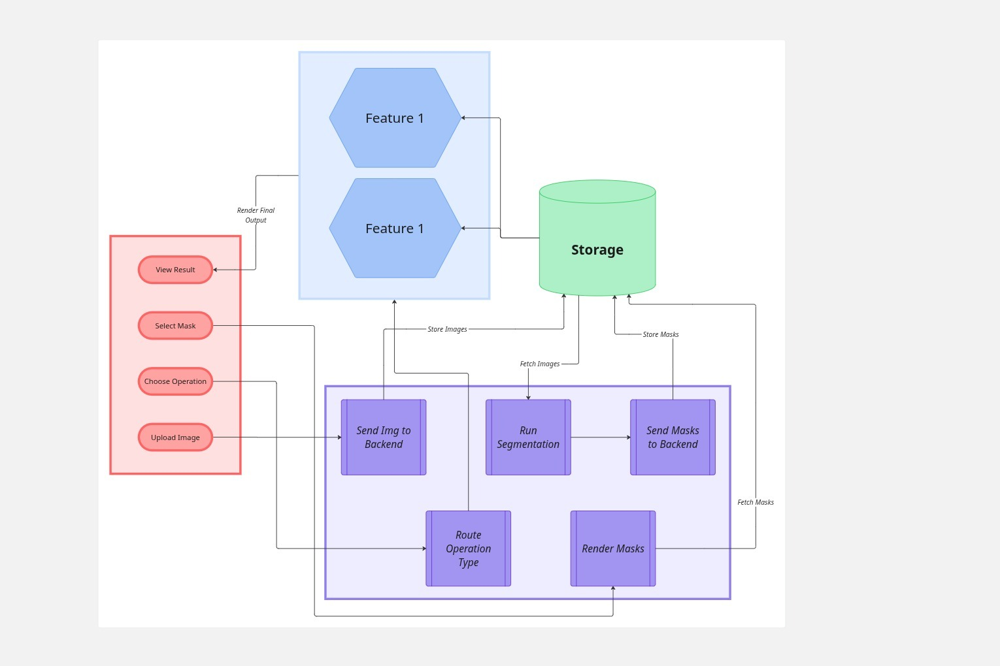
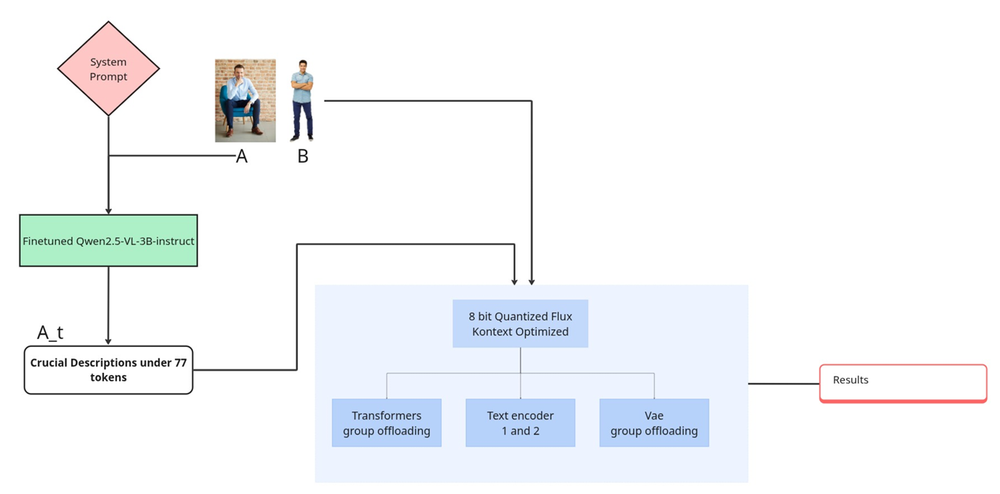

# Demo Video 

[Video Link](https://drive.google.com/drive/folders/1mzR3Xg_-TyKu9_2RwVrDxB1KMOM3iUNA?usp=sharing)

# PhotoShop 2030

---

# High-Level Architecture

This mobile-first solution reimagines image editing by integrating specialized AI agents for distinct operations: ObjectClear for background-aware erasure, Dragon Diffusion for semantic movement, and a Qwen-Flux pipeline for style transfer. The architecture separates presentation logic from model execution, ensuring that heavy generative tasks do not block the user interface. This approach allows for tiered service delivery, offering optimized layouts for both free and professional users across diverse hardware platforms.

---

# Feature 1 — Smart Object Editing  
### *(Inpaint, Erase, Move)*

## Pipeline

Move
Uses DDIM inversion to extract the object’s latent, shifts it using attention memory, and decodes it back to the image.

Inpaint
YOLO finds the object, a mask is made, and the Flux model fills or replaces that area based on the prompt.

Erase
U-Net creates attention maps of the object, suppresses them, and fuses the cleaned latent to remove the object from the image.

## Compute Profile
### YOLO Segmentation (On-Device)
- **Model Size:** < 200 MB  
- **Inference Time:** ~0.5 seconds  
- **Runs Fully On-Device**

### Flux Kontext
- **VRAM / RAM:** 10 GB VRAM + 20 GB RAM (can also run inverted: 20 GB VRAM + 10 GB RAM)
- **Inference Time:** ~28 seconds

### Dragon Diffusion
- **VRAM Required:** 9 GB
- **Inference Time:** ~21 seconds

### Erase Model
- **VRAM Required:** 7 GB 
- **Processing Time:** ~4 seconds

---

# Feature 2 — A/B → Result (Person-Composable Generation)

## Pipeline

Finetuned using [Qwen-VL-Series-Finetune](https://github.com/2U1/Qwen-VL-Series-Finetune) on [Dataset](https://www.mpi-inf.mpg.de/departments/computer-vision-and-machine-learning/software-and-datasets/mpii-human-pose-dataset) and [weights](https://huggingface.co/AdobeTeam67/Submission) are here. The system takes a system prompt along with inputs A (image) and B (image/text) and processes them through the instruction tuned model. For efficiency, descriptions under 77 tokens (A_t) are directly fed into an 8-bit quantized Flux model optimized with Kontext, which uses distributed processing across transformer groups, text encoders, and VAE components. The architecture enables efficient multimodal generation by combining visual and textual inputs with optimized inference through quantization and group offloading techniques.

## Compute Profile
### YOLO Segmentation (On-Device)
- **Model Size:** < 200 MB  
- **Inference Time:** ~0.5 seconds  
- **Runs Fully On-Device**

### Qwen2.5-3B (Finetuned – Instruct)
- **RAM Required:** 8 GB
- **Inference Time:** ~2 seconds

### Flux Kontext
- **VRAM / RAM:** 10 GB VRAM + 20 GB RAM  
  *(Can also run inverted: 20 GB VRAM + 10 GB RAM)*
- **Inference Time:** ~28 seconds

### You need to download [weight](https://huggingface.co/AdobeTeam67/Submission) file gguf and place it in flux_service.py
  

---

## Desicion Runtime

FLUX Kontext (FLUX.1-Kontext-dev)
- Off-loading device: Transformer and VAE 
- Seed: 42
- Inference steps: 10
Qwen2-VL-3B
- Off-loading device: CPU
Kandinsky Inpainting
- Off-loading device: xFormers 
- Seed: 92
- Inference steps: (Pipeline-controlled)
ObjectClear
- Off-loading device: CUDA (Attention-Guided Fusion )
- Seed: 42
- Inference steps: (Pipeline-controlled)
Dragon Diffusion
- Off-loading device: CUDA
- Seed: 42
- Inference steps: (Pipeline-controlled)
## Tech Stack

**Tech Stacks**
- Python
- FastAPI
- Flutter
- Docker
- - PyTorch
- Hugging Face Transformers
- Diffusers
- BitsAndBytes (8-bit / 4-bit quantization)
- Stable Diffusion cpp
- llama.cpp

